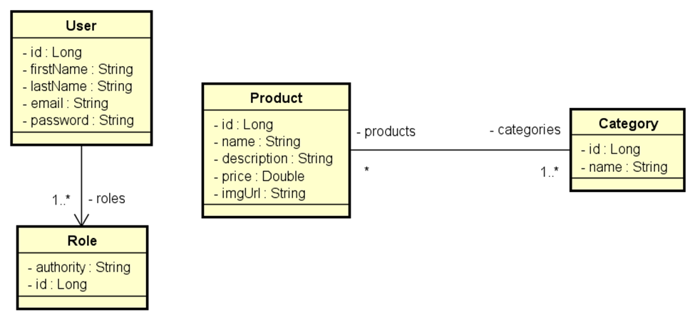

# Catalogo de Produtos

## 💻 Sobre o projeto

### Plataforma para cadastro de produtos:

- A plataforma deve permitir ao usuário criar playlists com links para seus vídeos preferidos, organizados por categorias.
- A persistência das informações será realizada utilizando o MySQL.
- Serviço login e autenticação para acesso às rotas GET, POST, PUT e DELETE.
- Testes Unitários e Testes de Integração.

### Entidades

### Validações / Regras de Negócio (em desenvolvimento)

